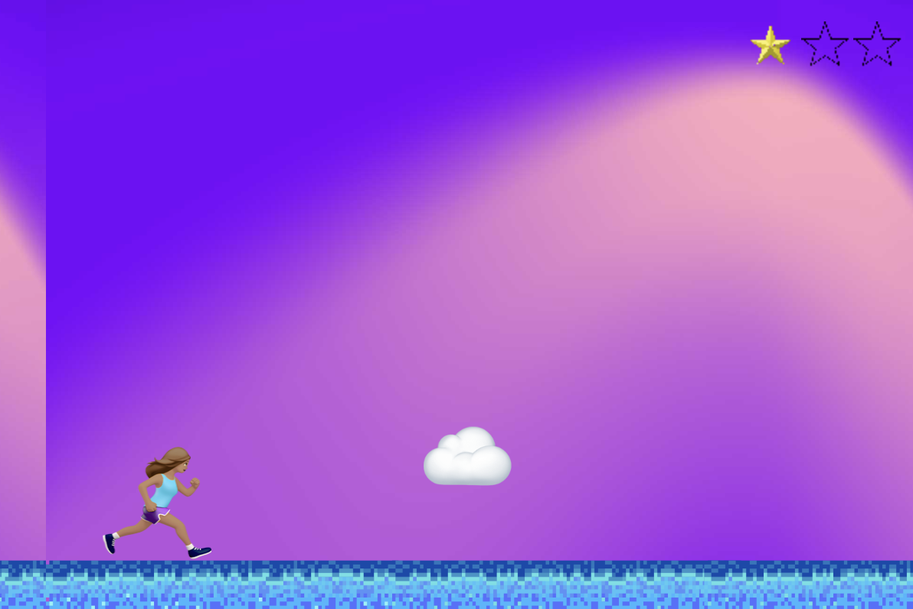

# 🌟 Dream Big — A Game Jam Project

**Dream Big** is a reimagined version of the classic Google Chrome T-Rex game—with a twist of inspiration and empowerment.

Instead of a dinosaur, you play as **Lily**, a girl chasing her dreams and dodging “fear clouds.” The goal? **Collect 3 dreams** while avoiding fear—and don't stop running.

## 🎮 Gameplay Overview

- Press **spacebar** to make Lily jump.
- Dodge **fear clouds** (obstacles).
- Collect all **3 dreams** to win.
- Crash into fear or miss a dream, and it's game over.

## 💡 Features

- Built using **p5.js** and **p5.play** for smooth game physics and interactivity.
- **Object-Oriented JavaScript**: Each game element (Lily, dreams, clouds) is built with its own class and behavior.
- Dynamic and responsive game loop with increasing difficulty.

## 🛠️ Tech Stack

- JavaScript (ES6+)
- p5.js & p5.play
- HTML/CSS
- Replit-compatible (with `.replit` and `replit.nix` files)

## 📁 Files & Structure

- `index.html` – Main HTML container for the game
- `script.js` – Core game logic
- `Lily.js`, `Dreams.js`, `Cloud.js` – Class definitions for each game object
- `style.css` – Custom styling
- `assets/` – Sprites and images for characters and objects

## 🚀 How to Play

1. Clone the repo or open in Replit.
2. Run the HTML file.
3. Press the **spacebar** to start jumping.
4. Dodge clouds 🌫️ and collect dreams 💭 to win!
